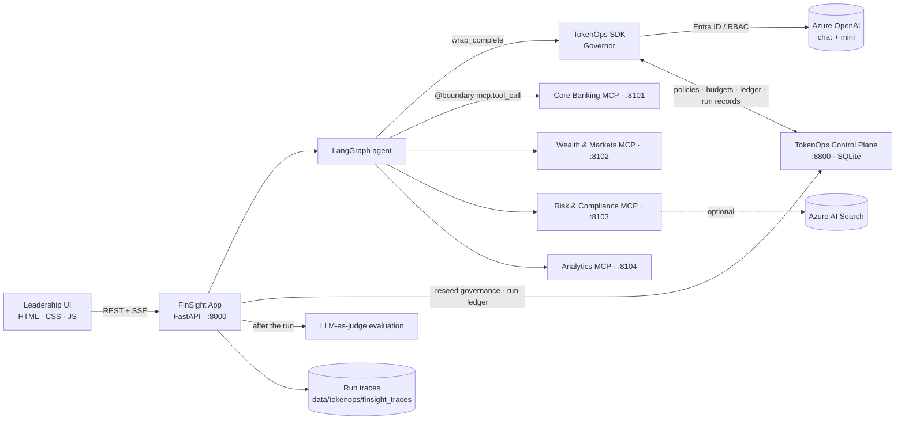

# FinSight AI + TokenOps

**Governed, traced and evaluated agentic AI for financial-services leadership.**

FinSight is a demo leadership-analytics app for a fictional bank. Executives ask questions in plain English. A LangGraph agent on Azure OpenAI answers them by discovering and calling tools on four MCP servers. Every LLM call and tool call is governed by **TokenOps**, which runs as a **separate control plane** and enforces a per-run budget and loop / tool / runaway-output policies. Every run is also **traced** (request/response payloads, latency, tokens, cost, safety checks) and **evaluated** after it finishes by an LLM-as-judge.


---

## Contents

- [Highlights](#highlights)
- [Architecture](#architecture)
- [Prerequisites](#prerequisites)
- [Quick start](#quick-start)
- [Configuration (.env)](#configuration-env)
- [Governance policy (config/governance.yaml)](#governance-policy-configgovernanceyaml)
- [The agent](#the-agent)
- [MCP servers and tools](#mcp-servers-and-tools)
- [Run tracing and evaluation](#run-tracing-and-evaluation)
- [Web UI](#web-ui)
- [HTTP API](#http-api)
- [Mock data](#mock-data)
- [Project layout](#project-layout)
- [Security notes](#security-notes)
- [Troubleshooting](#troubleshooting)

---

## Highlights

| Area | What you get |
|---|---|
| **Agentic AI** | LangGraph tool-calling agent (`agent ⇄ tools`) on Azure OpenAI through `langchain-openai`. |
| **Real MCP** | Four FastMCP servers using streamable HTTP. Tools are discovered at runtime; nothing is hard-coded. |
| **TokenOps governance** | The SDK (`agent-tokenops`) wraps every LLM call (`wrap_complete`). Every MCP call is a Chronicle `@boundary` crossing. Policies and budgets live in a separately run control plane (`agentplane-control-plane`). |
| **Per-run budget** | $0.25 hard cap per question, a pre-call worst-case check, and an automatic downgrade to the mini deployment at 80% of the budget. |
| **Enforce / Preview** | Enforce mode halts or blocks calls that break a policy. Preview mode only records what *would* have happened. |
| **Full run tracing** | A popup with a collapsible trace tree and waterfall timeline. It shows every LLM, tool, governance and evaluation span with formatted input/output payloads, latency, tokens and cost. |
| **Evaluation** | LLM-as-judge scores (groundedness, relevance, coherence, accuracy, completeness), plus checks for harmful content, jailbreak, prompt injection and PII leaks. |
| **RBAC only** | Entra ID (`DefaultAzureCredential`). No API keys anywhere. |
| **Leadership UI** | Glassmorphism, dark mode by default with a light toggle, GSAP animations, gradient text, Chart.js. |

---

## Architecture



How a single question flows through the system:

1. The UI sends `POST /api/agent/stream` with the question, persona, department and mode.
2. The app opens a TokenOps run (`tokenops_run`). The run is registered on the control plane, and a `Governor` is built from the plane's policies.
3. On each agent turn:
   - TokenOps checks the budget and policies, then calls Azure OpenAI and records spend on the plane ledger.
   - If `cost_guard` fires, the agent switches to the mini deployment.
4. Each requested tool call crosses a Chronicle boundary (step cap, tool fix, progress guard, output cap), then runs against the MCP server.
5. Events stream back to the UI over SSE. The trace is written to disk, and an evaluation is queued in the background.

---

## Prerequisites

- **Windows / macOS / Linux** with **Python 3.11** (the bundled venv uses 3.11.9).
- An **Azure OpenAI** resource with two chat deployments, for example `gpt-5.2-chat` (primary) and `gpt-5-nano` (cheap fallback and judge).
- Your identity needs the **Cognitive Services OpenAI User** role on that resource.
- **Azure CLI** signed in (`az login`), or any other credential that `DefaultAzureCredential` supports.
- *Optional:* **Azure AI Search** for policy-document search. Your identity needs **Search Index Data Reader** (plus **Search Index Data Contributor** to push the index). If this isn't configured, a local keyword index is used.
- Internet access for the CDN-hosted front-end libraries (GSAP, Chart.js, marked, DOMPurify).

---

## Quick start

All commands are PowerShell, run from the repository root.

```powershell
# 1. Create and populate the 'tokenops' virtual environment
python -m venv tokenops
.\tokenops\Scripts\python.exe -m pip install --upgrade pip
.\tokenops\Scripts\python.exe -m pip install -r requirements.txt

# 2. Sign in for RBAC (no keys)
az login                      # add --tenant <tenant-id> if you have several tenants

# 3. Configure: edit .env (endpoint, deployment names, prices) - see below

# 4. Start everything: control plane + 4 MCP servers + app
.\tokenops\Scripts\python.exe run_demo.py
```

Then open **http://localhost:8000/**. The Executive dashboard is the default page.

`run_demo.py` does the following, in order:

| Step | Process | Address | Health probe |
|---|---|---|---|
| 1 | Generates mock data if `data/catalog.json` is missing | – | – |
| 2 | TokenOps control plane (`control-plane serve`) | `http://127.0.0.1:8800` | `GET /health` |
| 3 | MCP servers (`core_banking`, `wealth_markets`, `risk_compliance`, `analytics`) | `:8101` – `:8104` `/mcp` | `GET /mcp` |
| 4 | FinSight app (`uvicorn app.server:app`) | `http://localhost:8000` | `GET /api/config` |

- `--no-plane` skips starting the control plane, for when one is already running elsewhere (set `CONTROL_PLANE_URL`).
- **Ctrl+C** stops every process.
- To regenerate the mock data, delete `data/catalog.json` or run `.\tokenops\Scripts\python.exe -m app.data_gen`.

> **Pinned versions:** `agent-tokenops 0.3.0` imports `chronicle.envelope.schema.InputState`, which `agent-chronicle 0.5.0` removed. Keep `agent-chronicle==0.4.0`.

---

## Configuration (.env)

All settings are read by [app/config.py](app/config.py). `.env` is git-ignored.

### Azure OpenAI (RBAC)

| Variable | Example / default | Purpose |
|---|---|---|
| `AZURE_OPENAI_ENDPOINT` | `https://<resource>.openai.azure.com/` | Azure OpenAI endpoint |
| `AZURE_OPENAI_API_VERSION` | `2024-12-01-preview` | API version |
| `AZURE_OPENAI_CHAT_DEPLOYMENT` | `gpt-5.2-chat` | Primary agent model |
| `AZURE_OPENAI_MINI_DEPLOYMENT` | `gpt-5-nano` | Cheaper model that `cost_guard` downgrades to; also the default judge |
| `AZURE_TENANT_ID` | *(blank)* | Optional: pins the tenant used by `DefaultAzureCredential` |

### Pricing (USD per 1M tokens, used for the TokenOps price book)

| Variable | Default |
|---|---|
| `PRICE_CHAT_INPUT_PER_1M` / `PRICE_CHAT_OUTPUT_PER_1M` | `2.50` / `10.00` |
| `PRICE_MINI_INPUT_PER_1M` / `PRICE_MINI_OUTPUT_PER_1M` | `0.15` / `0.60` |

> Set these to your contracted rates. Budgets, cost KPIs and the trace cost columns are all derived from them.

### Azure AI Search (optional)

| Variable | Default | Purpose |
|---|---|---|
| `AZURE_SEARCH_ENDPOINT` | *(blank → local index)* | Endpoint used by `search_policy_documents` |
| `AZURE_SEARCH_INDEX` | `finsight-policies` | Index name |

### TokenOps control plane

| Variable | Default | Purpose |
|---|---|---|
| `CONTROL_PLANE_HOST` / `CONTROL_PLANE_PORT` | `127.0.0.1` / `8800` | Where `run_demo.py` starts the plane |
| `CONTROL_PLANE_URL` | `http://127.0.0.1:8800` | URL the app and SDK use |
| `CONTROL_PLANE_DB` | `./data/tokenops/control_plane.db` | SQLite file holding the ledger, policies, budgets and runs |
| `CONTROL_PLANE_API_KEY` | *(blank)* | Bearer token if the plane is secured (blank = local demo) |
| `TOKENOPS_GOVERNANCE_FILE` | `./config/governance.yaml` | Policy file pushed to the plane |
| `TOKENOPS_RESEED_ON_START` | `true` | Re-push the policy file each time the app starts |
| `TOKENOPS_SERVICE` | `finsight-agent` | Service name on run records |
| `TOKENOPS_MODE` | `enforce` | Default mode: `enforce` or `preview` |

### MCP servers

| Variable | Default |
|---|---|
| `MCP_HOST` | `127.0.0.1` |
| `MCP_CORE_BANKING_PORT` | `8101` |
| `MCP_WEALTH_MARKETS_PORT` | `8102` |
| `MCP_RISK_COMPLIANCE_PORT` | `8103` |
| `MCP_ANALYTICS_PORT` | `8104` |

### Agent and evaluation

| Variable | Default | Purpose |
|---|---|---|
| `AGENT_MAX_ITERATIONS` | `12` | Maximum agent turns |
| `AGENT_TEMPERATURE` | *(blank)* | Leave blank for GPT-5 / o-series, which only accept the default |
| `EVAL_ENABLED` | `true` | Run the LLM-as-judge evaluation after each run |
| `EVAL_DEPLOYMENT` | *(blank → mini deployment)* | Judge model deployment |

### App

| Variable | Default |
|---|---|
| `APP_HOST` / `APP_PORT` | `127.0.0.1` / `8000` |
| `DATA_DIR` | `./data` |
| `LOG_LEVEL` | `INFO` |

---

## Governance policy (config/governance.yaml)

On startup (and whenever you click **Reseed** or **Re-discover tools**), the app reads this file. It fills in two values at runtime:

- the tool names discovered from the MCP servers go into `tool_fix.registry`;
- `cost_guard.downgrade_to` is set to `AZURE_OPENAI_MINI_DEPLOYMENT`.

It then pushes the result to the plane with `POST /v1/admin/reseed-governance`. Money is in micro-USD ($1 = 1,000,000).

| Policy | Setting | Effect (enforce mode) |
|---|---|---|
| **Budget `run_llm_cap`** | `limit_micros: 250000`, `dimension: run`, `period: lifetime` | $0.25 of LLM spend per question |
| `cost_budget` | budget `run_llm_cap` | **Halt** once actual spend exhausts the budget |
| `pre_call_worst_case` | `default_max_output: 4000` | **Reject** a call whose worst case (input + capped output) can't fit in the remaining budget |
| `cost_guard` | `threshold: 0.8`, `mode: downgrade` | **Mutate**: switch to the mini deployment at 80% of the budget |
| `step_cap` | `max_steps: 30` | **Halt** after 30 LLM + tool boundary crossings |
| `concurrency_cap` | `max_concurrent: 4`, `mode: reject` | Reject concurrent LLM calls above 4 |
| `tool_fix` | `k: 3` | Return a synthetic error for unknown (hallucinated) tool names; halt after 3 |
| `tool_output_cap` | `cap_tokens: 6000` | Flag oversized tool outputs (token-bloat protection) |
| `progress_guard` | `window: 6`, `repeats: 3`, `max_corrections: 2` | Detect repeated tool calls that make no progress |
| `context_compaction` | `ctx_max: 60000` | Compact the prompt when the context grows too large |
| `output_runaway` | `repeats: 4`, `max_retries: 2` | Detect degenerate, repetitive model output |

The per-run budget can also be changed live from the **TokenOps** page (`PUT /api/tokenops/budget`). Reseeding restores the value in the file.

**Modes**

- **Enforce:** policy actions are applied (halt, reject, model switch).
- **Preview:** the run continues, and the governance actions that *would* have fired are recorded and shown. This is useful for tuning policies safely.

---

## The agent

[app/agent.py](app/agent.py) builds a LangGraph `StateGraph(MessagesState)`:

```
START → agent ──(tool_calls?)──► tools ──► agent … → END
```

- **Personas:** CEO, CFO, CRO, COO, CMO, Head of Wealth. **Departments:** Executive Office, Finance, Risk, Operations, Marketing, Wealth. Both are attached to every run as TokenOps `user_dims`, which is how spend is attributed to people.
- **LLM calls** go through `tokenops.wrap_complete`, which applies the budget checks before dispatch and records the ledger afterwards. Calls use `AzureChatOpenAI` with an Entra ID bearer-token provider.
- **Tool calls** use `@boundary("mcp.tool_call", kind="tool")`. Tools run on the MCP client's event loop. Results are capped before they are sent to the model, scanned for prompt-injection phrases, and can be replaced by governance.
- **Model switch:** when `cost_guard` fires, the remaining calls use the mini deployment.

**SSE events** from `POST /api/agent/stream`:

| Event | Payload highlights |
|---|---|
| `run_start` | `run_id`, `mode`, `model`, tools available |
| `llm` | model, input/output tokens, call cost, cumulative cost, latency, requested tool calls |
| `tool_start` / `tool_end` | tool, server, args, size, latency, preview, `replaced_by_governance` |
| `governance` | `kind` (halt / mutate / reject / …), `policy`, `reason` |
| `model_switch` | `from`, `to`, `reason` |
| `halt` | reason, cost so far |
| `final` | answer (markdown), status, tokens, cost, budget, governance events, elapsed time |
| `error` / `done` | error message / end of stream |

---

## MCP servers and tools

Each server is a stateless FastMCP app using streamable HTTP. All SQL is read-only and parameterised, and the `group_by` / column values are allow-listed.

### Core Banking: `:8101`
Data: `core_banking.db` and CRM JSON files.

| Tool | Description |
|---|---|
| `search_customers` | Find customers by segment, region or name |
| `get_customer_profile` | 360° view: profile, accounts, loans, recent CRM interactions |
| `get_deposit_summary` | Deposit balances by segment, region or product |
| `get_transaction_trends` | Transaction volume and value by month, channel, merchant category or region |
| `get_loan_book_summary` | Loan book quality (NPL ratio, rates, credit scores) |
| `get_customer_sentiment` | CRM and NPS sentiment mix, contact reasons, churn risk |

### Wealth & Markets: `:8102`
Data: `wealth.db`, `daily_prices.csv` and `securities.json`.

| Tool | Description |
|---|---|
| `get_aum_summary` | AUM marked to market, by strategy, risk profile or advisor (YTD vs benchmark, fees) |
| `get_portfolio_details` | Holdings, weights and unrealised P&L |
| `get_underperforming_portfolios` | Portfolios lagging their benchmark (triggers the suitability policy) |
| `get_market_performance` | One-year price history, returns and volatility |
| `get_concentration_risk` | Portfolios whose concentration is above a threshold |

### Risk & Compliance: `:8103`
Data: `risk_compliance.db` and the policy markdown documents.

| Tool | Description |
|---|---|
| `get_aml_alert_summary` | Alerts by status and scenario, SLA breaches, SARs filed |
| `list_high_risk_aml_alerts` | Open high-risk alerts, oldest first |
| `get_credit_risk_summary` | EAD and expected loss (PD × LGD × EAD) by rating or watchlist |
| `get_watchlist` | Credit watchlist, largest expected loss first |
| `get_compliance_findings` | Regulatory and audit findings by severity and status |
| `search_policy_documents` | Search internal policies (Azure AI Search or local index) |

### Enterprise Analytics: `:8104`
Data: `enterprise_dw.db` (36 months).

| Tool | Description |
|---|---|
| `get_kpi_trend` | Monthly trend for one KPI (revenue, NII, opex, deposits, AUM, NPS, …) |
| `get_business_line_performance` | P&L by business line (TTM vs prior year), cost-to-income ratio |
| `get_regional_performance` | Revenue, net income, customer growth and NPS by region |
| `get_digital_engagement` | Digital channel adoption over time |

Use **Data & MCP → Re-discover tools** (or `POST /api/mcp/refresh`) after changing a server. The agent and the `tool_fix` registry pick up the new tool list.

---

## Run tracing and evaluation

### Opening a trace
Go to **TokenOps → Run Ledger** and click any run. A popup opens with:

1. **Header:** run id (with a copy button), question, status, mode, persona and department, model, start time.
2. **Run KPIs:** duration (LLM vs tool time), cost (% of budget), LLM calls (blocked), MCP calls (errors), input tokens (cached), output tokens (reasoning), governance actions, quality score.
3. **Summary panels:**
   - **Quality:** five 1–5 score bars with the judge's reasons, a summary, and the unsupported claims it found.
   - **Safety:** harmful content, jailbreak, prompt injection and PII exposure, combining every signal source.
   - **Breakdown:** wall time (LLM / tools / orchestration), tokens (input / cached / output), and any model switch.
4. **Trace tree and waterfall:**
   - The **run id is the collapsible root**. Under it are LLM calls, with their **MCP tool calls nested beneath**, governance actions (◆ markers), and the evaluation span.
   - Columns: timeline bar, latency, tokens in/out, cost, and a checks summary (✓ / ! / ✕).
   - **Expand all / Collapse all** is available.
5. **Span detail** (click any row):
   - **Request / Response:**
     - Formatted, syntax-highlighted JSON with copy buttons.
     - LLM spans show the request parameters and every message sent; earlier context collapses into "N earlier messages". The response shows content, requested tool calls and metadata, and the final answer is rendered as markdown.
     - Tool spans show the arguments and the result, with truncation flags.
   - **Evaluation:** the span's checks: content filter, Prompt Shields, tool-call validity, execution status, prompt-injection scan, output size, governance, plus the judge scores on the final answer.
   - **Metadata:** span and parent ids, start and end offsets, model latency vs SDK overhead, token details, cost, and raw content-filter results.

While the judge is still running, the popup refreshes itself every 2.5 s. Runs recorded before tracing existed show a summary with a "trace not available" note.

### Span kinds

| Kind | Colour | Recorded for |
|---|---|---|
| `llm` | purple | Every model call, including blocked or failed ones |
| `tool` | cyan | Every MCP tool call (`ok` / `error` / `halted`) |
| `governance` | amber ◆ | TokenOps actions and model switches |
| `eval` | green | LLM-as-judge evaluation (not charged to the run budget) |

### Safety signals

| Check | Sources |
|---|---|
| Harmful content (hate, sexual, violence, self-harm) | Azure OpenAI content-filter severities (prompt and completion), plus the judge |
| Jailbreak | Azure **Prompt Shields** (`jailbreak`), a heuristic pattern scan of the question, plus the judge |
| Prompt injection | Heuristic scan of every tool output, plus Prompt Shields `indirect_attack` when reported |
| PII leak | Judge |

> Content-filter and Prompt Shields data appear only when your Azure OpenAI endpoint returns them. Otherwise they show as *not reported / n/a*.

### Evaluation (LLM-as-judge)

[app/evaluation.py](app/evaluation.py) runs on a background thread pool after the response has been sent, so it never adds latency to the run. The judge (`EVAL_DEPLOYMENT`, defaulting to the mini deployment) receives the question, the answer and the tool evidence. It returns JSON with:

- `groundedness`, `relevance`, `coherence`, `accuracy`, `completeness`: each a 1–5 score with a reason; `overall` is their mean;
- `harmful_content`, `jailbreak`, `pii_leak`, `unsupported_claims`, and `summary`.

The judge's cost and latency are stored on the trace and in the run metrics, but they are **not charged to the run budget**. The ledger's **Quality** column shows the overall score and a ⚠ count when safety flags were raised.

### Storage
- Traces: `data/tokenops/finsight_traces/<run_id>.json`, one JSON file per run, written atomically. Payloads are clipped at 12k characters per message and 20k per tool output.
- Run metrics sidecar: `data/tokenops/finsight_run_metrics.json`.
- **Clear run history** on the TokenOps page wipes the plane's runs and ledger, the metrics and the traces, then re-applies governance.

---

## Web UI

Plain HTML, CSS and JavaScript in [web/](web/), with no build step. The libraries come from the jsDelivr CDN: GSAP 3.12.5, Chart.js 4.4.4, marked 12.0.2 and DOMPurify 3.1.6.

| Page | Contents |
|---|---|
| **Executive** *(default)* | 8 KPI tiles (revenue, net income, cost/income, deposits, loans, AUM, NPS, net new customers); revenue and net-income trend; revenue mix; regional performance; risk and wealth tiles; AI cost-governance KPIs; **Ask FinSight** rail on the right |
| **Analytics** | Business-line revenue, digital users, market performance, channels, loan health, credit ratings, AML scenarios, strategies, sentiment, segments |
| **AI Analyst** | Full chat with persona/department, Enforce/Preview toggle, quick prompts, live budget gauge, run stats and live trace timeline |
| **TokenOps** | Budget editor, active policies, governance-actions chart, spend by persona, **Run Ledger** (opens the trace popup), clear history |
| **Data & MCP** | Architecture view, data-source catalog with row counts, discovered MCP servers and tools, re-discover button |

- The window never scrolls; each pane scrolls on its own.
- Dark theme is the default; use the header toggle to switch (the choice is saved in `localStorage`).
- The footer is pinned: **CREATED BY | CHINMOY C.**

---

## HTTP API

| Method | Path | Purpose |
|---|---|---|
| GET | `/api/health` | Control plane, Azure OpenAI and MCP server status, with tool counts |
| GET | `/api/config` | Deployments, default mode, plane URL, search backend |
| GET | `/api/dashboard` | Executive dashboard data |
| GET | `/api/analytics` | Analytics page data |
| GET | `/api/datasources` | Data catalog with existence, size and row counts |
| GET | `/api/mcp/tools` | Discovered tools, grouped by server |
| POST | `/api/mcp/refresh` | Re-discover tools and reseed governance |
| POST | `/api/agent/stream` | Run the agent; Server-Sent Events. Body: `{question, persona, department, mode}` |
| GET | `/api/tokenops/summary` | Spend, budgets, policies, governance events, run ledger |
| GET | `/api/tokenops/runs/{run_id}` | Enriched run record plus `trace` (null for older runs) |
| PUT | `/api/tokenops/budget` | Set the per-run cap `{limit_usd}` |
| POST | `/api/tokenops/reseed` | Re-push `governance.yaml` |
| POST | `/api/tokenops/clear-history` | Wipe runs, ledger, metrics and traces (refused while a run is in progress) |
| GET | `/` | The single-page UI (static assets served from `web/`) |

Control-plane endpoints the app uses: `/health`, `/v1/admin/reseed-governance`, `/v1/admin/clear-all`, `/v1/run-records/{id}`, `/v1/budgets/{id}`, `/v1/ledger/spent`.

---

## Mock data

[app/data_gen.py](app/data_gen.py) generates deterministic data (seed `20260930`) under [data/](data/):

| Source | Type | Contents |
|---|---|---|
| `core_banking/core_banking.db` | SQLite (OLTP) | customers, accounts, transactions, loans |
| `crm/crm_interactions.json`, `crm/nps_survey.json` | JSON | CRM interactions, sentiment, NPS |
| `market_data/daily_prices.csv`, `market_data/securities.json` | CSV / JSON | One year of end-of-day prices, security master |
| `wealth/wealth.db` | SQLite | portfolios, holdings |
| `risk_compliance/risk_compliance.db` | SQLite | AML alerts, credit risk, compliance findings |
| `risk_compliance/policies/*.md` | Markdown | AML, credit appetite, KYC, wealth suitability, AI usage and cost governance policies |
| `warehouse/enterprise_dw.db` | SQLite (OLAP) | 36 months of `kpi_monthly` and `digital_engagement` |
| `catalog.json` | JSON | Data-source registry shown on the Data & MCP page |

Runtime state lives in `data/tokenops/` (git-ignored): the control-plane DB, run metrics and traces.

---

## Project layout

```
tokenomics/
├─ run_demo.py                  # one-command launcher (plane + 4 MCP servers + app)
├─ requirements.txt
├─ .env                         # configuration (git-ignored)
├─ config/
│  └─ governance.yaml           # TokenOps budgets + policies
├─ app/
│  ├─ server.py                 # FastAPI routes, SSE, static UI
│  ├─ agent.py                  # LangGraph agent + TokenOps wiring + trace spans
│  ├─ tokenops_integration.py   # control-plane client, price book, governance push, run metrics
│  ├─ tracing.py                # per-run trace model, safety normalisation, injection scan
│  ├─ evaluation.py             # background LLM-as-judge
│  ├─ mcp_client.py             # MCP discovery and calls (langchain-mcp-adapters)
│  ├─ azure_auth.py             # DefaultAzureCredential / bearer-token provider
│  ├─ dashboard.py              # executive + analytics aggregates
│  ├─ data_gen.py               # deterministic mock-data generator
│  ├─ config.py                 # settings from .env
│  └─ mcp_servers/              # FastMCP servers + shared helpers
├─ web/
│  ├─ index.html
│  ├─ css/styles.css
│  └─ js/app.js
├─ data/                        # mock data (+ data/tokenops runtime state)
├─ images/                      # architecture and TokenOps concept diagrams
└─ tokenops/                    # Python virtual environment (git-ignored)
```

### Concept diagrams

| | |
|---|---|
|  |  |
|  |  |
|  |  |
|  | |

---

## Security notes

- **No API keys:** Azure OpenAI and Azure AI Search use Entra ID RBAC via `DefaultAzureCredential`. `.env` is git-ignored, and no secrets are stored in it.
- **Least privilege:** grant only *Cognitive Services OpenAI User* and *Search Index Data Reader*.
- **Read-only data access:** MCP servers open SQLite read-only, use parameterised queries, and allow-list identifiers.
- **XSS:** model output is rendered with `marked` and sanitised by DOMPurify. All other dynamic text, including trace payloads, is HTML-escaped before rendering.
- **Path safety:** run ids are validated before any trace file is read.
- **Control plane:** binds to `127.0.0.1` with no auth for the local demo. Set `CONTROL_PLANE_API_KEY` and put it behind TLS for any shared deployment.
- **Prompt injection:** tool outputs are scanned and flagged in the trace. Treat MCP data as untrusted input.

---

## Troubleshooting

| Symptom | Fix |
|---|---|
| `Azure OpenAI: not configured` pill | Set `AZURE_OPENAI_ENDPOINT` and the deployment names in `.env`, then restart |
| `401` / `403` from Azure OpenAI | Run `az login` (with `--tenant`), check the *Cognitive Services OpenAI User* role, set `AZURE_TENANT_ID` |
| `Unsupported value: 'temperature'` | Leave `AGENT_TEMPERATURE` blank for GPT-5 / o-series deployments |
| Control plane offline | Make sure port 8800 is free, or start with `--no-plane` and point `CONTROL_PLANE_URL` at your plane |
| MCP server offline / 0 tools | Check ports 8101–8104, then **Data & MCP → Re-discover tools** |
| `ImportError … InputState` | Pin `agent-chronicle==0.4.0` |
| Runs halt immediately | The per-run budget is too low for the model's worst case. Raise it on the TokenOps page or reseed |
| Trace popup says "not available" | The run predates tracing or history was cleared. Ask a new question |
| Quality shows "—" | `EVAL_ENABLED=false`, the judge deployment is missing, or the run halted or errored (the evaluation is skipped and the reason is shown in the popup) |
| UI changes not visible | Hard-refresh (Ctrl+F5). Backend changes need `run_demo.py` restarted |

---

<p align="center"><b>CREATED BY | CHINMOY C.</b></p>
